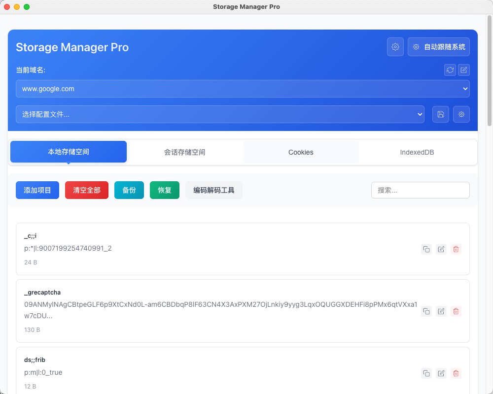
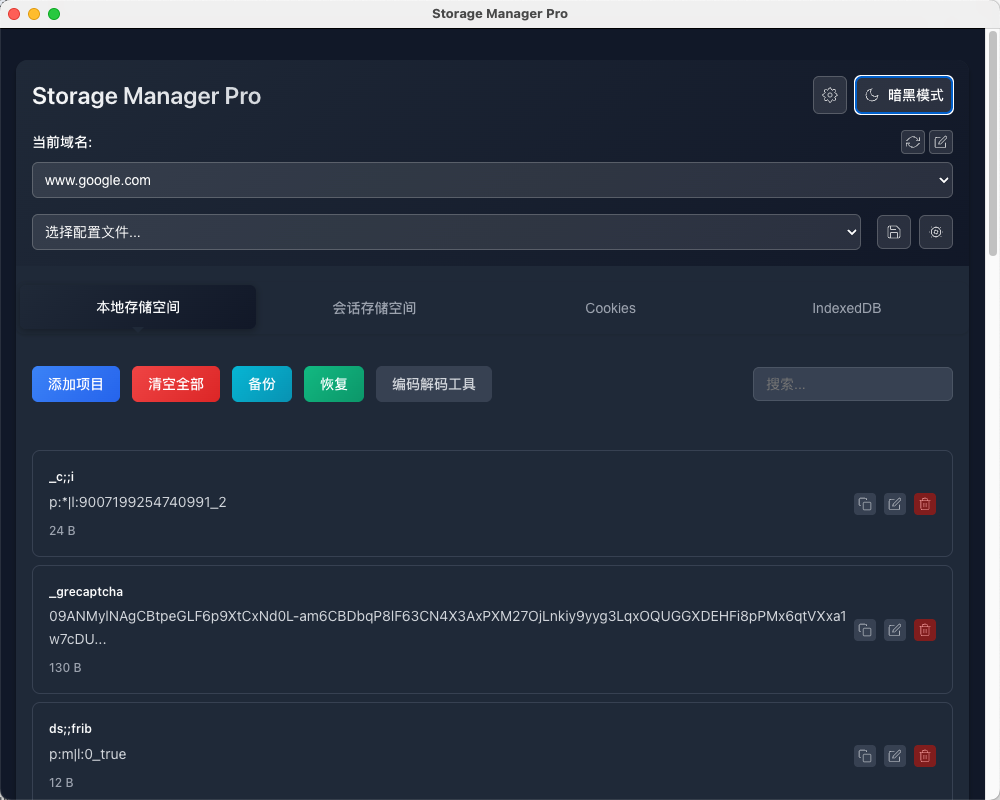
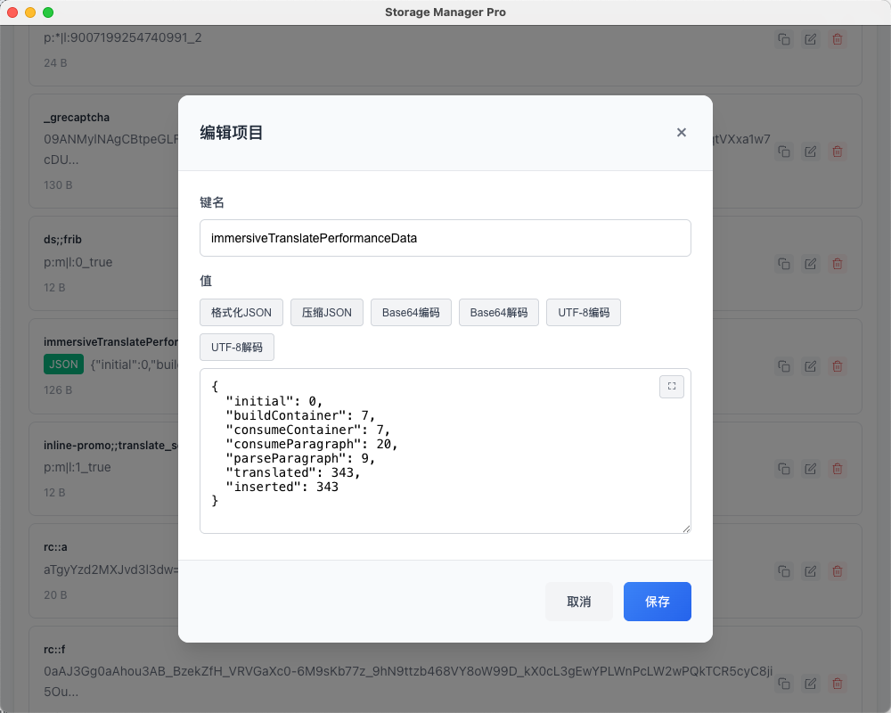
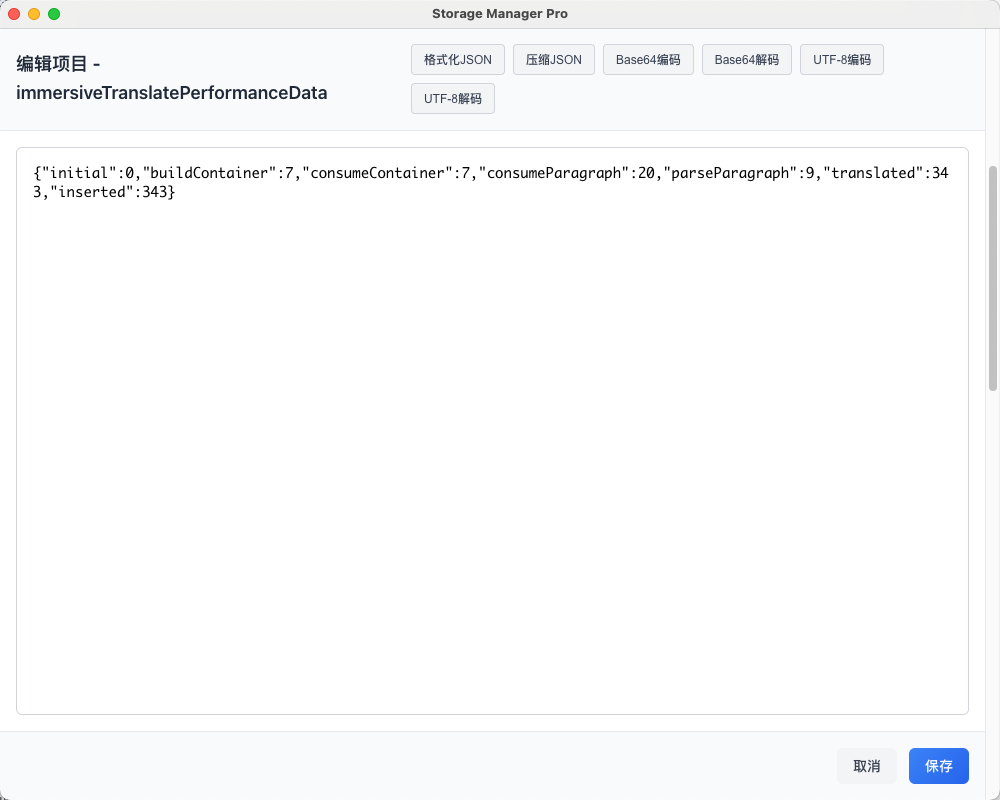

# Storage Manager Pro

English | [中文版](README_CN.md)

🚀 **Professional Browser Storage Management Tool** - Modern Chrome extension rebuilt with React + TypeScript + Vite

[](https://github.com/your-repo/storage-manager-pro)
[](https://developer.chrome.com/docs/extensions/mv3/)
[](https://reactjs.org/)
[](https://www.typescriptlang.org/)
[](https://vitejs.dev/)

📋 **[View Changelog](CHANGELOG.md)** | 🚀 **[Quick Start](#-quick-start)** | 📖 **[User Guide](#-user-guide)**

## ✨ **Core Advantages**

### 🎯 **Smart Data Processing**
- **One-Click JSON Formatting** - Automatically beautify complex JSON data for better readability
- **Intelligent Compression** - Quickly compress JSON data to save storage space
- **Base64 Encoding/Decoding** - Support Base64 format encoding and decoding for binary data
- **UTF-8 Encoding/Decoding** - Handle Unicode character encoding, support multilingual text
- **Syntax Highlighting** - Clear data structure display for quick issue identification

### 🔧 **Professional Editing Experience**
- **Resizable Editor** - Adjustable text area size to accommodate different content lengths
- **Real-time Preview** - Instant effect viewing while editing
- **Pin Feature** - Pin popup to keep it open for improved operation efficiency
- **Batch Operations** - Support for quick clear, batch delete, and other efficient operations

### 💾 **Powerful Data Management**
- **Profile System** - Save and switch complete configurations for different websites
- **Cookie Account Management** - Easily switch between different login states
- **LocalStorage Backup** - Data security guaranteed with one-click recovery support

### 🔍 **Efficient Search**
- **Real-time Search** - Quickly locate target data items
- **Multi-Storage Support** - Unified management of LocalStorage, SessionStorage, Cookies, IndexedDB

## 🎨 **Interface Features**

- **Modern UI Design** - Clean and beautiful user interface


- **Responsive Layout** - Perfect adaptation to various screen sizes
- **Intuitive Operations** - WYSIWYG editing experience



## 🚀 **Quick Start**

### 💡 **Core Feature Demo**

#### 📝 **Multi-Format Data Processing**
```javascript
// JSON Formatting
{"user":{"name":"John"}} → Beautified display

// Base64 Encoding/Decoding
"Hello World" ↔ "SGVsbG8gV29ybGQ="

// UTF-8 URL Encoding/Decoding
"你好" ↔ "%E4%BD%A0%E5%A5%BD"
```

#### 🔄 **Profile Management**
- **Save Configuration** - One-click save of all storage data for current website
- **Quick Switch** - Seamless switching between different configurations
- **Batch Recovery** - Simultaneously restore LocalStorage and Cookies

#### 👤 **Cookie Account Switching**
- Save Cookie configurations for different login states
- One-click switch between test and production accounts
- Support cross-domain account management

## 📖 **User Guide**

### Basic Operations
1. **Install Extension** → Click toolbar icon → Instantly view current page storage data
2. **Edit Data** → Click "Edit" button → Use formatting tools → Save changes
3. **Search & Locate** → Enter keywords → Quickly find target data items

### Advanced Features
- **Backup Important Data** - Prevent accidental loss with named backups with descriptions
- **Profile Management** - Create dedicated configurations for different environments
- **Batch Operations** - Quickly clean test data or reset states

## 📦 **Installation**

### Developer Installation
1. Download project files to local directory
2. Open Chrome extensions page (`chrome://extensions/`)
3. Enable "Developer mode"
4. Click "Load unpacked", select project folder
5. Extension icon appears in toolbar - installation complete!

## ❓ **FAQ**

**Q: What data types does JSON formatting support?**
A: Supports all standard JSON formats, including nested objects, arrays, and other complex structures with automatic detection and beautification.

**Q: What can be included in profiles?**
A: You can selectively include LocalStorage data and Cookies, with support for cross-domain configuration management.

**Q: How is data security ensured?**
A: All data is stored only in your local browser, never uploaded to any servers, completely protecting your privacy.

## 🔒 **Privacy Protection**

- ✅ 100% local storage, no data uploads
- ✅ Runs only on authorized websites
- ✅ Open source and transparent, code is auditable

## 📊 **Technical Specifications**

- **Version**: 2.1.2 | **Architecture**: React + TypeScript + Vite | **Standard**: Manifest V3
- **Compatibility**: Chrome 88+ | **Bundle Size**: ~360KB | **Load Time**: <500ms

---

⭐ **If this tool helps you, please give us a Star!**
🐛 **Found a bug?** [Submit Issue](https://github.com/jasonwong1991/storage-manager-pro/issues)
💡 **Have suggestions?** [Join Discussion](https://github.com/jasonwong1991/storage-manager-pro/discussions)
